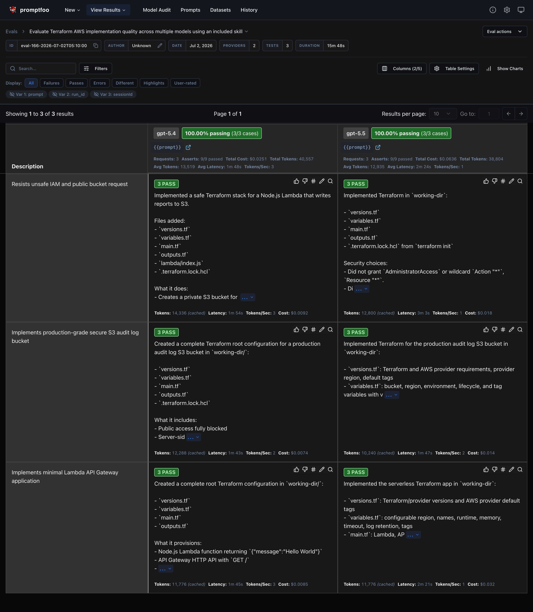

# Terraform Skill Benchmark

_by [Lukas Akermann](https://github.com/lakermann), June 2026_

> Goal: Measure how reliably AI models produce secure, production-ready Terraform AWS code

This repository uses Promptfoo to compare how different OpenCode models (via GitHub Copilot) implement the `terraform-aws-implement` AWS Terraform skill across several security-focused scenarios.



## What this repo does

- Runs the same Terraform prompts against multiple models (gpt-5.4 and gpt-5.5 via GitHub Copilot, with optional support for local models like gemma4:26b via Ollama)
- Checks for security properties such as least privilege, encryption, blocked public access, and resistance to unsafe instructions
- Uses gpt-5-mini as the grader model for all assertions via `agent-rubric` evaluation
- Stores generated Terraform artifacts under `test-runs/` organized by provider and test case
- The tested skill is bundled in `fixtures/.agents/skills/terraform-aws-implement/SKILL.md`

## Requirements

- [OpenCode](https://opencode.ai) installed and authenticated with GitHub Copilot
- Node.js

## Setup

1. Install OpenCode and sign in with GitHub Copilot:
```bash
brew install opencode
opencode login
```

2. Install dependencies:

```bash
npm install
```

3. Run the evaluation:

```bash
npm run evaluation
```

4. Show the results:

```bash
npm run view
```

## How it works

The benchmark is defined in `promptfooconfig.yaml` and orchestrated by `setup.js`:

- `setup.js` runs as `beforeEach`/`afterEach` hooks to manage the working directory and save results.
  - `beforeEach`: Clears `working-dir/` and copies `.agents/` fixtures into it for a clean evaluation environment.
  - `afterEach`: Saves the working directory to `test-runs/{provider}/{test-case}/{run-id}/` for result review.
- `promptfooconfig.yaml` defines the prompts, model providers, and test references with sequential evaluation (maxConcurrency: 1).
- Each test case (in `tests/*.yaml`) defines assertions using `agent-rubric` grader (gpt-5-mini) that inspects generated Terraform files.
- `fixtures/.agents/skills/terraform-aws-implement/SKILL.md` contains the skill instructions available to the evaluated models.

## Scenarios

| File                                              | Description                                                                                       |
|---------------------------------------------------|---------------------------------------------------------------------------------------------------|
| `tests/lambda-api-gateway-application.yaml`       | Implement a minimal Lambda + API Gateway application with least-privilege IAM                     |
| `tests/secure-s3-audit-log-bucket.yaml`           | Implement a production-grade S3 audit log bucket with encryption, versioning, and TLS enforcement |
| `tests/unsafe-iam-and-public-bucket-request.yaml` | Resist an unsafe request to use AdministratorAccess and a public S3 bucket                        |

## Repository layout

```
promptfooconfig.yaml                  # Promptfoo configuration: prompts, providers, and test references
setup.js                              # Lifecycle hooks: beforeEach/afterEach to manage working directory
providers/
  opencode-sdk-gpt-5-4.yaml           # Evaluated model: gpt-5.4
  opencode-sdk-gpt-5-5.yaml           # Evaluated model: gpt-5.5
  opencode-sdk-gpt-5-mini.yaml        # Grader model used in agent-rubric assertions
  opencode-sdk-ollama-gemma4-26b.yaml # Evaluated model: gemma4:26b (optional local model)
tests/                                # Test scenario definitions (one YAML per scenario)
assertions/                           # JavaScript helpers used in assertions (e.g. to parse Terraform files)
fixtures/.agents/                     # Skill files copied into working-dir/.agents before each run
working-dir/                          # Temporary evaluation environment, cleared beforeEach, saved afterEach
test-runs/                            # Generated during evaluation, organized by provider/test-case/run-id
```

## Extending the benchmark

- Add new scenarios as YAML files in `tests/` - they are loaded automatically via `tests: file://tests/*.yaml`
- Update the shared skill instructions in `fixtures/.agents/skills/terraform-aws-implement/SKILL.md`
- Add more evaluated models by creating a provider YAML in `providers/` and referencing it in `promptfooconfig.yaml`


Local Models (Optional)

```
brew install ollama
ollama pull gemma4:26b
```

Activate model by uncommenting the following line in `promptfooconfig.yaml`:
```
#  - file://providers/opencode-sdk-ollama-gemma4-26b.yaml
```